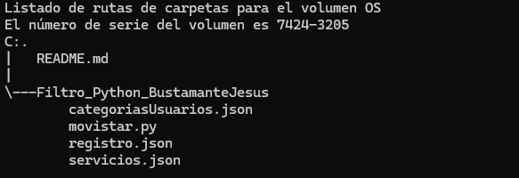

# Mi Movistar

Sistema Integral de registro y seguimiento para una empresa telefónica.

# Índice

1. [Estado del Proyecto](#id1)
2. [Descripción del Proyecto](#id2)
3. [Tecnologías Utilizadas](#id3)
4. [Estructura del proyecto](#id4)
5. [Características](#id5)
6. [Diseño](#id6)
7. [Instrucciones](#id7)
8. [Personas Desarrolladoras del Proyecto](#id8)

# Estado del proyecto

Finalizado

# Descripción del Proyecto

## Funcionalidades del Módulo de Usuarios (Administrador)

**Registro y Gestión de Usuarios:**

- Operaciones CRUD para crear, leer, actualizar y eliminar perfiles de usuarios.

- Captura de información detallada de cada usuario, incluyendo nombre, dirección, información de contacto, entre otros.

- Funcionalidad para asignar categorías de usuarios, como nuevos clientes, clientes regulares y clientes leales.

**Seguimiento del Historial de Usuarios:**

- Registro y almacenamiento de servicios utilizados por cada usuario.

- Seguimiento de las interacciones de los usuarios con la empresa, como consultas de servicio al cliente, reclamaciones y sugerencias.

**Personalización de Servicios:**

- Utilización de datos de usuario para ofrecer servicios y promociones personalizadas.

- Análisis de patrones de comportamiento de los usuarios para adaptar la oferta de servicios a las necesidades individuales.

**Gestión de la Fidelización de Clientes:**

- Identificación y seguimiento de clientes leales basados en la duración de su relación con la empresa.

- Integración con el módulo de bonificaciones para ofrecer recompensas especiales a los clientes más fieles.

## Funcionalidades Requeridas para Cada Módulo

**Módulo de Gestión de Servicios:**

- Operaciones CRUD para cada tipo de servicio ofrecido, como Internet de Fibra Óptica, planes pospago, prepago, etc.
- Capacidad para agregar, modificar y eliminar servicios según sea necesario.
- Registro de información detallada sobre cada servicio, incluyendo características, precios, entre otros.

**Módulo de Reportes:**

- Generación de informes sobre la cantidad de productos/servicios ofrecidos por la empresa.
- Análisis de datos para identificar los servicios más populares que se prestan por la empresa.
- Informes sobre usuarios que han adquirido cada servicio y con ello la cantidad de este mismo.

**Módulo de Bonificaciones para Clientes Leales:**

- Identificación automática de clientes que han permanecido con la compañía por más de 10 años.
- Cálculo y asignación de bonificaciones especiales para estos clientes, como descuentos, servicios adicionales gratuitos, entre otros (Solamente notificación para ser redireccionado al asesor de ventas).

# Tecnologías utilizadas

* Python

# Estructura del proyecto

# Características

Archivos Fundamentales:

**movistar.py**: Este archivo es el corazón del sistema. Contiene el código que maneja la parte lógica del programa, es fundamental para que funcione el sistema.

**categoriasUsuarios.json**: Aquí se guarda la información de los clientes de acuerdo a su categoría, que pueden ser nuevos clientes, clientes regulares o clientes leales.

**registro.json**: Aquí se guarda la información de cada cliente, dada por ellos mismos al momento del registro a la plataforma.

**servicios.json**: Aquí se guarda la información de cada servicio (características y precio) que ofrece la empresa. Además, cada servicio ofrece la información de los clientes que lo han adquirido.

# Diseño

* Solo puede ser visto y usado en consola

# Instrucciones

1. Clonar el repositorio
~~~
https://github.com/JesusBustamante/Filtro_python_BustamanteJesus.git
~~~

2. Si es clonado en Visual Studio Code, descargue la extensión de Python.

3. También descargue python desde un navegador web o la microsoft store.

3. Ejecuta el programa en la terminal de GitBash de la siguiente forma: 
~~~ 
python movistar.py 
~~~

# Personas Desarrolladoras del Proyecto

Este proyecto fue desarrollado por Jesús Leonardo Bustamante Ramírez, estudiante de Campuslands como parte del proyecto final del módulo de python.